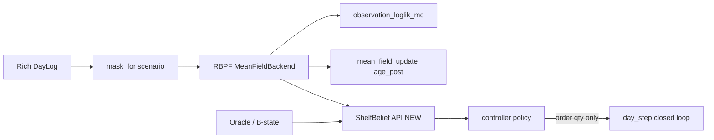

# M2 — Controller and multi-scenario

**Status:** PLAN (architecture lock in Wave 0; implementation T-023+)  
**Date:** 2026-08-12  
**Authority:** Board milestone `M2 — controller and multi-scenario` (CTL-01–06 ACCEPTED); team-owned copy of the Cursor draft with post–T-021 edits  
**Does not edit:** M1 / M1.5 Cursor plan files

---

## 0. Placement and prerequisite

| Milestone | Intent |
| --- | --- |
| **M1 / M1.5** | Filter + RichObs + MC LL + multi-rung verification; production age belief = mean-field |
| **M2 (this plan)** | CTL-01–06: belief API, damped SW base-stock, one-step rollout, α tuning, full ladder, toy DP, multi-scenario closed-loop |
| **M3** | VOI sweep (VOI-01–04); owns dollar VOI aggregation |

### Prerequisite — COMPLETE

**T-021** (FIL-13 production → mean-field) is **DONE** on `main` at `d240414` (ADR [0091](../adr/0091-fil13-production-mean-field.md) ACCEPTED; Stage C settle; `PRODUCTION_BACKEND == "mean_field"`).

M2 does **not** wait on T-021. Do **not** redo T-021 or reopen joint / `K^L` production.

### Settle basis (binding)

| Card / path | Settle |
| --- | --- |
| **FIL-04** | **C — mean-field** (validated by Stage C) |
| **FIL-13 production** | **B — `mean_field`** |
| Joint / `K^L` / joint→`sliding_window` **production** | **Parked** (bakeoff arms A–E retained; no production `choose_backend` → sliding_window) |
| Particle **weights** | Stay `observation_loglik_mc` (ADR 0087) |

Controller belief = **MF marginals** `age_post` shape `(N, L, K)` via **`ShelfBelief`** — never joint tensors.

---

## 1. What M2 is / is not

| In M2 | Out (M3 / locked out) |
|-------|------------------------|
| Belief API for CTL (`ShelfBelief` → \(\tilde I_t\)) on MF RBPF + B-state oracle | Full VOI sweep (scenario × β), VOI-01–04 headlines |
| CTL-01 damped SW base-stock; CTL-02/04 one-step rollout + H/salvage | Browser packaging / ENG-01; Plotly (ENG-03) |
| CTL-03 α tuned by sim for **every** ladder arm | Misspecification / CE arms (VOI-02=A) |
| CTL-05 full ladder + CTL-06 toy exact DP gap | Cull/markdown sequencing (X-04=A); SCN-B-clair |
| ENG-04 M2 CI gates: β=1 degeneracy, CRN desync, DP certificate | New runtime deps without ADR; reopen ⚑ without Oliver |
| Closed-loop under **P1** + **B-state** ceiling + Rung 0; API smoke for other masks | Dollar VOI tables across all M1.5 rungs |
| Remeasure empirical L under the **real controller** (FIL-13 bakeoff follow-up) | Replacing MF with joint again |

**“Multi-scenario” in M2** (locked): information scenarios that change the *belief the policy sees* — age-blind Rung 0, P1 filter belief, B-state oracle — not the M3 outer-loop VOI grid.

### Eventual browser compat (not in scope)

Cite [M2-controller-agent-brief.md](./M2-controller-agent-brief.md): keep `controller/` a pure library so a future ENG-01 / Pyodide façade is not painted into a desktop-only corner. Prefer list/float-friendly belief fields, optional compute-budget knobs on rollout APIs, CRN via `spawn_rng`, one `day_step` physics path, no FS/viz/pyarrow inside `controller/`.

**Not M2 deliverables:** Pyodide packaging, GH Release wheels, Astro islands, WASM/FFI, browser demo. If a brief item conflicts with shipping CTL cleanly, **ship CTL** and leave a one-line ticket note. M2 success = CTL ladder + multi-scenario closed-loop, not WASM.

---

## 2. Post–T-021 filter contract M2 consumes

- Public today: `RBPF.step` → `FilterSummary`; `age_posterior(lot)`; private `ParticleState` / `_state`.
- M2 adds controller-facing **`ShelfBelief`**: particle-weighted counts + MF age marginals → \(\tilde I_t\), plus pipeline term \(\sum_j q_{t-j}\mathbb E_g[w_j]\).
- Prefer `survival_weighted_on_hand(..., from_marginals=True)` (already in `filter/age_likelihood.py`).
- Do **not** assume joint tensors or production `choose_backend` → `sliding_window`.

---

## 3. Design locks (Wave 0 ADRs)

| Lock | Choice |
|------|--------|
| **Belief API** | ADR **0092**: `ShelfBelief`, `shelf_belief_from_rbpf` (MF `age_post`), `shelf_belief_from_oracle`, `effective_inventory(...)`. Controller never reads `RBPF._state`. Prefer list/float-friendly fields. |
| **Day profit** | ADR **0093**: extract SIM-01=B (margin − waste − stockout) into `sim/profit.py`; no I/O; M3 owns VOI aggregation. |
| **Action space** | Order quantity only (X-04); `case_round` to `ModelParams.case_size` (8). |
| **Base policy** | CTL-01=C: \(q_t=\mathrm{caseRound}(\rho[F^{-1}_{D_{t:t+L}}(\alpha)-\tilde I_t]^+)\). Default **ρ=0.8** until CTL-06/CRN says retune; α from CTL-03. |
| **Protection interval** | Daily delivery LT=1 (X-11); same \(\Delta\tau_L\) for age-aware and Rung 0 (CTL-06 trap). |
| **Rollout** | CTL-02=B single-step; CTL-04=B H≈2× shelf life + survival-weighted terminal salvage \(V_T=m\sum w_{\mathrm{long}}(\tau)n\); paired CRN via SIM-05 streams. |
| **Ladder** | CTL-05=A: constant → corrected age-blind (Rung 0) → SW (ρ) → SW+rollout → toy DP. |
| **Toy DP** | CTL-06=A: small demand, truncated τ, ~2 lots; report gap vs rollout. |
| **Eval scenarios** | Primary closed-loop: **P1**. Ceiling: **B-state**. Blind: Rung 0. Other masks: interface smoke only. |
| **Figures** | Static matplotlib under `figures/m2/` (ENG-03); never inside `controller/`. |

---

## 4. Waves and tickets

| Wave | Tickets | Mode |
|------|---------|------|
| **0** | T-022 + ADR 0092–0093 + specs T-023–T-034 | Serial architect (docs only) — **next / in progress** |
| **1** | T-023 ∥ T-024 ∥ T-025 ∥ T-026 | Parallel foundations |
| **2** | T-027 ∥ T-028 | Parallel base policies |
| **3** | T-029 | Serial α tuning gate |
| **4** | T-030 ∥ T-031 | Parallel rollout + toy DP |
| **5** | T-032 | Ladder + ENG-04 gates |
| **6** | T-033 | Multi-scenario + L remeasure |
| **7** | T-034 | Close-out |

| ID | Title | Depends |
|----|-------|---------|
| **T-022** | M2 ADR/spec lock | T-021 (done) |
| **T-023** | Belief API (`ShelfBelief`) | T-022 |
| **T-024** | Closed-loop driver + `Policy` | T-022 |
| **T-025** | Day profit helper | T-022 |
| **T-026** | `case_round` + constant order | T-022 |
| **T-027** | Rung 0 corrected age-blind | T-025, T-026 |
| **T-028** | CTL-01 damped SW | T-023, T-025, T-026 |
| **T-029** | CTL-03 α tuning | T-024, T-027, T-028 |
| **T-030** | Rollout + salvage (+ optional budgets) | T-024, T-025, T-028 |
| **T-031** | Toy exact DP | T-028 |
| **T-032** | Ladder + ENG-04 gates | T-029, T-030, T-031 |
| **T-033** | Multi-scenario + L remeasure | T-032 |
| **T-034** | M2 close-out | T-033 |

Wave order: `T-022 → (T-023 ∥ T-024 ∥ T-025 ∥ T-026) → (T-027 ∥ T-028) → T-029 → (T-030 ∥ T-031) → T-032 → T-033 → T-034`.

Belief wording for all tickets: **MF marginals** / `from_marginals=True` — not joint age posteriors.

---

## 5. Definition of done (M2)

1. **Belief API** stable; CTL never touches `RBPF._state`; works with MF marginals and B-state oracle.
2. **CTL-01** damped SW + **CTL-02/04** one-step rollout with CRN and documented H/\(V_T\).
3. **CTL-03** tuned α artifact for every ladder arm.
4. **CTL-05** full five-point ladder runnable; **CTL-06** toy DP gap reported.
5. **ENG-04** automated: β=1 degeneracy, CRN desync, DP certificate — CI red if broken.
6. **Multi-scenario**: P1 / B-state / Rung 0 closed-loop results published; other masks smoke only.
7. **Empirical L** under controller recorded; production remains **mean_field** (T-021).
8. **No** VOI sweep, browser packaging, or honesty arms shipped; `voi/` stays stub.
9. agent-dev-team: AC pass · reviews APPROVED · qa green · plain-English changelog.

---

## 6. Risks

| Risk | Mitigation |
|------|------------|
| MF Stage-3 drift under long closed-loop | T-033 watch SW deltas vs B-state; no silent joint revert |
| caseRound swallow (Gate 0b) | Document; X-12=no tripwire; do not claim $ VOI in M2 |
| Untuned α manufactures fake ladder gaps | T-029 hard gate before T-032 claims |
| CRN desync looks like weak rollout | ENG-04 automated stream test |
| Per-particle MF cost × rollout × N | Profile in T-030; reduce N for unit tests only; no stub MF |
| Scope creep into M3 VOI or Pyodide | Non-goals binding; T-034 asserts no VOI/browser packaging ship claims |

---

## 7. Immediate next step

**Wave 0** (this ticket family): land ADR 0092–0093 ACCEPTED, specs T-022–T-034, README M2 table, backlog Next → Wave 1 after lock. Then Wave 1 parallel qa RED on T-023–T-026.
