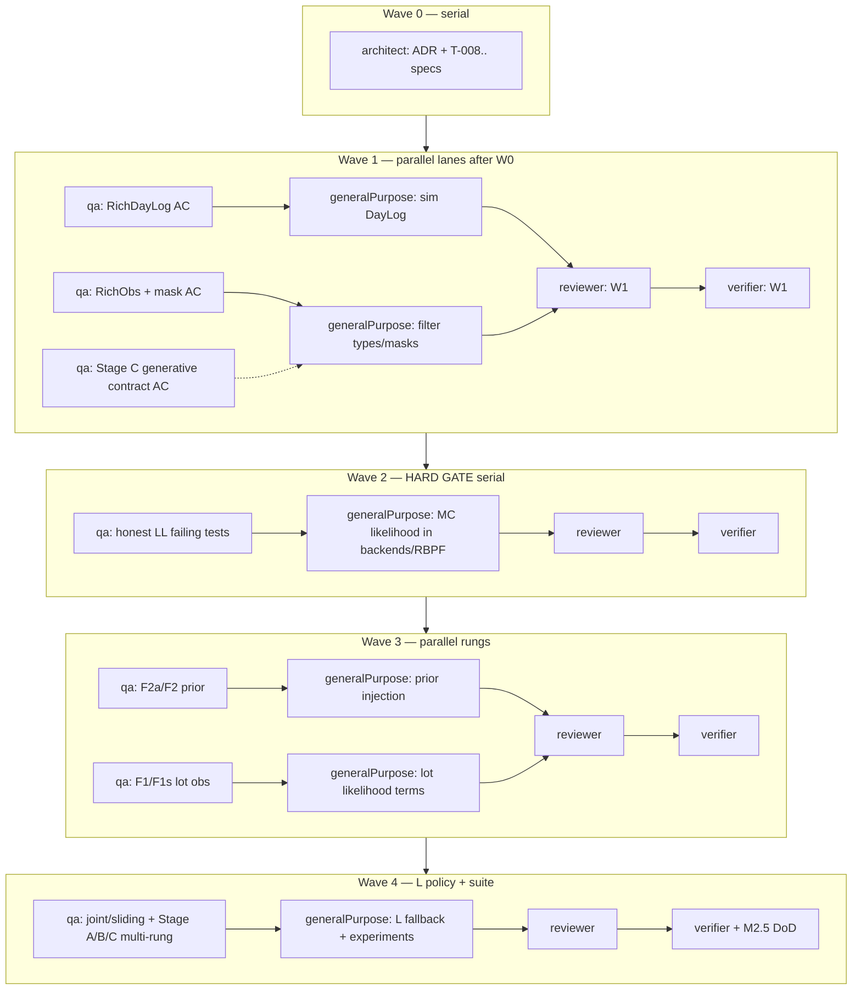

# M2.5 — Filter complete across data-availability rungs

**Status:** PLAN (architecture + implementation; no code yet)  
**Date:** 2026-08-12  
**Authority:** Oliver-approved intent — insert between M1 (P1 shell, known gaps) and controller/VOI  
**Does not edit:** M1 Cursor plan file

---

## 0. Placement in the program

| Milestone | Intent |
| --- | --- |
| **M1** | ≈ done with gaps: soft / heuristic likelihood, P1-only `P1Obs`, Stage A FAIL under defaults (documented), DayLog drops per-lot sales/waste |
| **M2.5 (this plan)** | Honest likelihood + richest observations + FIL-08 masks + verification across **settled data-availability** rungs. **Controller not implemented.** |
| **M2 / M2.6** | Controller (CTL-*) wired to the same belief interface |
| **M3** | VOI sweep (VOI-*) |

M2.5 exists so later VOI columns measure *information*, not “filter bug vs rung.”

---

## 1. Goals / non-goals

### Goals

1. **One filter binary** that consumes the **richest observation schema** (`RichObs`), with **per-rung masks** ([FIL-08]=C).
2. **Physics-honest observation likelihood** — weights from the same MOD-12 / `day_step` kernels the simulator uses ([ENG-02]), not soft powers / Gaussian toy terms.
3. **Sim emits richest `DayLog`** every day (per-lot sales, waste, ages, receipt metadata); rungs only change what the filter is *allowed to see*.
4. **Verification suite** redefines FIL-11 Stages A/B/C for multi-rung honesty, plus a **lot-level oracle ladder** (SCN-B-state as intermediate ceiling on inventory info).
5. **Tractability under long-dwell** — explicit joint vs `sliding_window` policy when empirical `L` grows ([FIL-12]/[FIL-13]).
6. Leave a **stable belief API** for M2.6 controller without implementing CTL.

### Non-goals (explicit)

- **No CTL** — no base-stock / caseRound policy improvement, no CTL-01–06 code beyond what M1 already uses as open-loop driver.
- **No VOI sweep** — no dollar columns, no misspecification arms, no X-06 axes.
- **No browser** ([ENG-01] remains out).
- **No new ladder rungs** — do not invent scenarios; use board membership only (§2).
- **No reopening ⚑ cards** without Oliver (FIL-01, FIL-08, FIL-12, MOD-14/15/17, SCN-P2/F3/B-clair, …).
- **No new runtime deps** unless a dedicated ADR justifies against ADR 0084 (numpy/scipy/matplotlib + pyarrow).
- **Does not claim** “P1 recovers age under defaults” — Stage A may still fail at P1 after an honest likelihood; higher rungs may pass. That outcome is **acceptable** for M2.5 DoD if documented.

---

## 2. Settled scenario membership (do not invent)

Source: per-rung SCN cards (X-05 superseded as aggregate). **M2.5 data-availability set** = IN cards that change *what is observed* (or the arrival prior), excluding action-space / foresight oracles that are controller-era.

| Card | Membership | Role in M2.5 |
| --- | --- | --- |
| **SCN-P0** | **In** | Books only — per [MOD-17]=A: **P1 without daily waste** (receiving error dropped) |
| **SCN-P1** | **In** | Shrink gun — daily waste totals (+ exact arrivals [MOD-14]=A; perfect reporting [MOD-15]=B) |
| **SCN-P2** | **Out** ⚑ | Not modelled |
| **SCN-F1** | **In** | Partial lot ID at POS — age-/lot-resolved sales for fraction ρ (biased sample; start ρ=1 unbiased if needed as interim, name bias as follow-on) |
| **SCN-F1s** | **In** | Lot ID on shrink gun — age-/lot-resolved deaths (identifies μ) |
| **SCN-F2a** | **In** | Pack date on ASN — **narrows arrival-age prior only** (not a new sales/waste structure) |
| **SCN-F2** | **In** | Age at receipt observed (full age-resolved sales; cold-chain telemetry optional / defer if speculative) |
| **SCN-F3** | **Out** | Changes action space; conflicts with X-04 |
| **SCN-B-state** | **In** | Perfect state oracle — **verification / ceiling**, not a filter mask (bypass filter; hand true state) |
| **SCN-B-clair** | **Out** ⚑ | Foresight; controller/VOI denominator later |

**M2.5 verification rungs (filter masks):** P0, P1, F1, F1s, F2a, F2.  
**Oracle intermediate:** B-state (lot-level truth → belief identity / skip filter).

---

## 3. Architecture

### 3.1 Current M1 gaps (must fix)

| Gap | Evidence | M2.5 fix |
| --- | --- | --- |
| Soft / heuristic likelihood | `backends._rbpf_update`: `sales_pow` / `waste_pow` on picking & death probs + Gaussian `sales_ll`/`waste_ll` | Replace with generative / MC likelihood from shared kernels |
| P1-only obs | `P1Obs(sales_total, waste_total, arrivals)` | `RichObs` + mask |
| DayLog aggregates only | `DayLog` has totals; `day_step` already returns `sales_by_cohort` / `waste_by_cohort` but sim drops them | Extend `DayLog` / SIM-04 rich emit |
| Stage C self-check | `tv_vs_exact` uses the **same soft likelihood** as the filter → TV≈0 is tautological | Redefine Stage C as generative check vs `day_step` |
| Stage A FAIL @ defaults | prior_sd≈1.98 → post≈2.23; scenario sweep: long dwell or β=4 can contract under soft LL | Re-run after honest LL; P1 fail still OK |
| Fixed `PRODUCTION_L=3` | Long-dwell cells hit L≈7–8; filter still tracks 3 slots | Dynamic L + joint/sliding_window policy |

### 3.2 RichObs schema vs masks

**Principle ([FIL-08]=C):** one richest observation model; rungs differ only by which fields are **present**.  
**Critical:** missing ≠ zero. A masked field is *not observed* (likelihood does not condition on it). Writing `0` for “no waste observed” on P0 would falsely update as “zero waste.”

Recommended `RichObs` fields (frozen dataclass; `Optional` / sentinel `UNOBSERVED`):

| Field | Semantics | P0 | P1 | F1 | F1s | F2a | F2 |
| --- | --- | --- | --- | --- | --- | --- | --- |
| `arrivals` | Units received (exact, MOD-14) | ✓ | ✓ | ✓ | ✓ | ✓ | ✓ |
| `sales_total` | POS units (censored stockout OK) | ✓ | ✓ | ✓ | ✓ | ✓ | ✓ |
| `waste_total` | Daily shrink-gun total | ✗ | ✓ | ✓ | ✓ | ✓ | ✓ |
| `sales_by_lot` | Map lot_id → sales | ✗ | ✗ | ✓ (ρ) | ✗ | ✗ | ✓ |
| `waste_by_lot` | Map lot_id → waste | ✗ | ✗ | ✗ | ✓ | ✗ | ✓ |
| `pack_date` / `asn_age_hint` | Pack/harvest → prior narrowing | ✗ | ✗ | ✗ | ✗ | ✓ | (subsumed) |
| `age_at_receipt` | Measured τ_in for new lot | ✗ | ✗ | ✗ | ✗ | ✗ | ✓ |
| `lot_ids_live` | Known live lot identity set | weak | weak | ✓ | ✓ | weak | ✓ |

**Mask object:** `ObsMask` or `ScenarioId → frozenset[field names present]`.  
API: `mask.apply(rich: RichObs) -> RichObs` that sets absent fields to `UNOBSERVED`, never to `0`.

**P0 vs P1 ([MOD-17]):** only difference is presence of `waste_total` (and thus waste likelihood term). Do not invent receiving error.

**F1 ρ:** board allows biased early-adopter sampling. M2.5 default recommendation: implement structure with **ρ=1 unbiased** first (exact per-lot sales); add biased-ρ as optional sensitivity cell, not a gate, unless Oliver prioritizes it.

### 3.3 F2a vs F2 (arrival prior)

| Rung | What changes |
| --- | --- |
| **F2a** | On delivery, **replace/narrow** that cohort’s arrival-age prior using pack date → implied transit/age band (still a prior; no new sales/waste likelihood). Cheapest rung ([SCN-F2a]). |
| **F2** | Observe **age at receipt** (point or tight measurement). Age coordinate can collapse toward a **count HMM** for that lot ([SCN-F2] narrative). Optionally colder: full age-resolved sales (overlap with F1 at ρ=1). |

Implementation sketch: both write into the same `age_post` / prior channel on cohort birth; F2 sets a Dirac (or tiny) prior on the grid bin of measured τ_in; F2a sets a truncated/weighted prior from ASN pack date + Abdella-style transit uncertainty.

### 3.4 Physics-honest observation likelihood

**Problem with M1 soft LL:** age update uses powered picking / death probabilities and a Gaussian match on totals — not the law of the MOD-08 Wallenius allocation + MOD-04 binomial deaths. Stage C matched that toy exact path (TV≈0) without validating generative correctness.

**Recommendation (M2.5 decision to lock in ADR during Wave 0):**

**Primary: Monte Carlo likelihood from shared `day_step` kernels (bootstrap-compatible).**

Given particle state (counts, ages on grid or sampled), for each particle:

1. Simulate one (or M) forward day transitions using **the same** `allocate_sales` / `death_prob_survival_ratio` / NB demand path as the sim ([ENG-02] / [MOD-12]), conditioned on the particle’s latent state.
2. Score observed fields that are present under the mask (Poisson/Binomial exact where closed form exists; otherwise kernel / histogram density from M sims; or indicator match for discrete counts with Laplace smoothing).
3. Weight particles by that likelihood; never require Wallenius **density** for the proposal ([FIL-10]=A bootstrap — simulate only).

**Why MC from kernels beats alternatives for this repo:**

| Alternative | Reject / defer because |
| --- | --- |
| Keep soft powers | Already failed Stage A honesty; Stage C tautological |
| Closed-form Wallenius density | [FIL-10] deliberately avoids; density is a 1-D integral nightmare |
| Separate pluggable LL per rung | Contradicts FIL-08=C (masks, one model) |
| Exact forward only | Only for toy L/K; keep as *auxiliary* check, not the production LL |

**Redefine Stage C:**  
Old: TV(filter posterior, “exact” update under soft LL) ≈ 0.  
**New Stage C — generative agreement:** under identical seeds / CRN where applicable, predictive distribution of masked observations from particle-propagated `day_step` matches empirical frequencies from the simulator (or KL/TV on discrete obs within tol). Optionally: at small L/K, compare RBPF marginal to brute-force filter that uses the **same** MC/closed-form LL (non-tautological vs physics).

### 3.5 Joint vs sliding_window when L grows

Settled: [FIL-13]=E full joint at **measured** M1 L (p50≈2, max≈3). Long-dwell scenario cells push L to 7–8 → `K^L·N` trips `MAX_JOINT_FLOATS`.

**M2.5 policy:**

1. Production default remains **full_joint** while `joint_state_count(K,L,N) ≤ budget`.
2. If empirical L (or configured max live cohorts) would exceed budget → **auto-fallback to `sliding_window`** (already implemented as bakeoff backend A), with logged reason — do **not** silently truncate L ([FIL-13] guard rule).
3. Re-measure L under M2.5 open-loop **and** under any long-dwell verification cells; record in experiment MD.
4. Do **not** reopen FIL-12=B without Oliver; sliding_window is the **pre-approved fallback**, not a silent contradiction.

### 3.6 Single filter binary + richest DayLog

```
sim.run_episode ──► RichDayLog (ground truth + all observables)
                         │
                         ▼
              mask_for(scenario) ──► RichObs (UNOBSERVED holes)
                         │
                         ▼
              RBPF.predict_update (honest LL + shared day_step)
                         │
                         ▼
              belief summary (for future CTL; unused in M2.5 except tests)
```

- **One** `RBPF` class; scenario is a mask argument, not a subclass.
- At F1+ lot scanning, optional **exact per-lot forward** path may be enabled *behind the same interface* ([FIL-08] asymmetry) and cross-checked against MC where both valid — but M2.5 can ship MC-only first if exact path is a follow-on ticket.
- B-state: controller-era / verification harness feeds true `(n,τ)` and skips filtering; not a mask that invents observations.

### 3.7 Shared day_step (non-negotiable)

- All transitions in filter proposal and sim **import** `blueberries_voi.model.day_step` ([ENG-02], [MOD-12]).
- Regression test: assert identical `order_of_ops` and shared function identity / no duplicated spoilage formula in filter backends.
- [FIL-09]=A: waste booked same day (no lag buffer in M2.5).

---

## 4. Verification suite

Shared **CRN** across rungs for Stage A (same `root_seed` / SIM-05 streams; only mask differs) so differences are informational, not RNG luck ([SIM-02]/[SIM-05]).

### 4.1 Stage A — contraction across data-availability rungs

For each rung in {P0, P1, F1, F1s, F2a, F2}:

- Compare arrival-age posterior spread vs prior (and tight-spread control), using a **cohort-from-birth** metric where possible (fix oldest-slot-only artifact when L_filter < empirical L).
- **Pass language:** “After seeing this rung’s observations, the filter’s uncertainty about arrival age is meaningfully tighter than the cold-chain prior (e.g. ≥5% SD contraction), and the tight-prior control still collapses.”
- **Expected honesty:** P0/P1 may **FAIL** under defaults even with proper LL; F2a/F2 should **PASS**; F1/F1s should improve vs P1 (sales vs deaths identification). Document, do not paper over.

### 4.2 Stage B — calibration per rung

- Many worlds; rank histograms + 90% CI coverage for quantities the rung can identify (arrival age and/or lot counts).
- **Pass language:** “Truth falls in the 90% interval about 90% of the time; ranks not U-shaped (overconfident) or strongly dome-shaped (underconfident).”
- Apply fully on rungs that Stage A passes; on failing P0/P1 run as **diagnostic only** (same pattern as M1 post-A-fail), clearly labeled.

### 4.3 Stage C — generative check vs day_step (replaces heuristic self-check)

- **Pass language:** “Observation probabilities the filter uses are the same physics the simulator uses within tolerance X (TV/KL on discrete obs, or paired CRN match rate).”
- Must **fail** if someone reintroduces soft powers while sim stays Wallenius/binomial.

### 4.4 Oracle ladder (lot-level intermediate)

- **B-state:** belief ≡ true lot state (or filter bypass). Used to bound “information about inventory” and to sanity-check that higher rungs approach oracle age knowledge.
- **Pass language:** “With perfect state, age error is zero by construction; F2 posterior error ≪ P1 error on shared CRN episodes.”
- B-clair remains **out** of M2.5.

### 4.5 Plain-language pass/fail summary (DoD table)

| Check | Pass means | Fail means |
| --- | --- | --- |
| A @ F2 / F2a | Receipt / pack-date info actually tightens age belief | Bug in prior injection or mask |
| A @ F1 / F1s | Lot-resolved sales or deaths teach age / kernels better than totals | Coupling/LL bug |
| A @ P1 / P0 | Optional; fail OK if documented | Not a M2.5 blocker alone |
| B @ passing rungs | Credible intervals honest | Wrong LL or under/overconfidence |
| C generative | Filter ≠ toy self-consistency | Soft LL regression |
| Oracle gap | F2 closer to B-state than P1 | Masking or schema bug |
| Quality gates | ruff / mypy / pytest≥80% | CI red |

---

## 5. Implementation phases (TDD / agent-dev-team)

Protocol: **architect → qa (failing tests) → implement → reviewer → verifier** per ticket/wave. Role done when `.team/` files exist.

### Phase 0 — Architecture lock (architect only)

- Promote plan decisions to ADR(s): RichObs+mask, MC likelihood, Stage C redefine, L/joint fallback.
- Write specs T-008+ with observable acceptance criteria.
- Update `.team/specs/README.md` wave table.

### Phase 1 — Rich logging + schema (no LL change yet)

- Extend `DayLog` / SIM-04: per-lot sales, waste, τ, pack_date / age_at_receipt fields from `day_step`.
- Introduce `RichObs`, `UNOBSERVED`, masks for P0…F2.
- Tests: mask never coerces missing→0; sim CRN stable.

### Phase 2 — Honest likelihood (hard serial gate)

- Replace soft LL in backends / RBPF with MC-from-`day_step` scoring of masked fields.
- Bootstrap proposal still simulates allocation ([FIL-10]); no Wallenius density.
- Stage C generative tests **must fail** on old soft path, **pass** on new.
- **Gate:** no rung Stage A/B “claims” until this is green.

### Phase 3 — Prior channels F2a / F2 + lot-resolved terms F1 / F1s

- Wire pack-date prior narrowing; age-at-receipt Dirac/tight prior.
- Score `sales_by_lot` / `waste_by_lot` when unmasked.
- Optional exact per-lot forward behind same interface (can slip to Phase 3b).

### Phase 4 — Tractability under long L

- Dynamic L; memory guard → sliding_window fallback; re-bakeoff snippet if needed.
- Cohort-from-birth Stage A metric.

### Phase 5 — Multi-rung verification suite

- Stage A/B/C (+ oracle) experiments under shared CRN; figures under `figures/m2.5/`; result MD.
- M2.5 close-out review + changelog (client voice) when verified.

---

## 6. Maximal sub-agent concurrency plan

### 6.1 Hard serial gates

```text
RichObs + DayLog  ──►  masks
         \                \
          \                +──► rung Stage A/B claims
           \
            └──► honest LL (Phase 2)  ──► ANY rung VOI-ready / A-pass claims
```

1. **Likelihood fix before rung VOI claims** — and before treating Stage A PASS on a rung as “filter works.”
2. **Masks after RichObs** — cannot mask fields that do not exist.
3. **F2a/F2 prior injection after RichObs delivery metadata** exists in logs.
4. **verifier** after reviewer APPROVED per wave; never parallel with unfinished impl on same ticket.

### 6.2 What can run in parallel

Within a wave, after architect specs land:

- **qa** tickets that don’t share files (e.g. DayLog tests ∥ mask unit tests ∥ Stage C contract tests) once interfaces are frozen in specs.
- **generalPurpose** implementers on disjoint modules: `sim/` logging vs `filter/types` schema vs `viz/fil11` harness stubs — **not** two agents on `backends.py`.
- Experiment runners (Stage A per rung) after Phase 2, in parallel across rungs with shared CRN seeds.
- **reviewer** of ticket N while **qa** writes failing tests for ticket N+1 (if N merged/approved).

### 6.3 Mermaid — parallel waves / lanes



### 6.4 `subagent_type` map

| Role | `subagent_type` | When |
| --- | --- | --- |
| Design ADR/specs | `architect` | Wave 0; any new public interface |
| Failing tests from AC | `qa` | Start of each ticket |
| Implementation | `generalPurpose` (or parent impl) | After qa red |
| Independent review | `reviewer` | After code; never self-review |
| AGENTS.md gates | `verifier` | End of wave / milestone |
| Deep diagnosis / experiments | `generalPurpose` or `explore` | Read-only or script runners |
| Shell-heavy experiment batches | `shell` | Long Stage A grids |

---

## 7. Tickets sketch (T-008+)

Next free number after M1: **T-008**. Outlines only — full `.team/specs/T-XXX.md` written in Wave 0.

| ID | Title | Acceptance criteria outline | Depends |
| --- | --- | --- | --- |
| **T-008** | ADR lock: RichObs, MC LL, Stage C redefine, L fallback | ADRs ACCEPTED; INDEX updated; no production code | Plan |
| **T-009** | Rich `DayLog` / SIM-04 emit | Episode log includes per-lot sales, waste, τ; CRN regression green | T-008 |
| **T-010** | `RichObs` + `UNOBSERVED` + scenario masks | Masking P0 hides waste without zeroing; round-trip from DayLog; unit tests | T-008 |
| **T-011** | Honest MC observation likelihood | Soft powers removed; weights use shared kernels; old Stage C tautology test deleted/replaced | T-009, T-010 |
| **T-012** | Stage C generative check | Fails under injected wrong physics; passes under shared `day_step` within tol | T-011 |
| **T-013** | F2a pack-date prior + F2 age-at-receipt | On delivery, prior mass concentrates as specified; masked rungs unchanged | T-010, T-011 |
| **T-014** | F1 / F1s lot-resolved likelihood | When unmasked, lot sales/waste update that lot’s age/counts; cross-lot leakage test | T-011 |
| **T-015** | Dynamic L + joint→sliding_window fallback | Guard trips → sliding_window with log; no silent L truncate; bakeoff note | T-011 |
| **T-016** | Multi-rung Stage A (shared CRN) | Script+MD+figures for P0,P1,F1,F1s,F2a,F2; P1 fail allowed if documented | T-013, T-014, T-015 |
| **T-017** | Stage B per passing rung + oracle ladder | Calibration MD; B-state gap table vs F2/P1 | T-016 |
| **T-018** | M2.5 close-out | QA green, reviews APPROVED, changelog entry, DoD checklist signed | T-012, T-017 |

Suggested wave grouping: T-008 → (T-009 ∥ T-010) → T-011 → T-012 → (T-013 ∥ T-014) → T-015 → T-016 → T-017 → T-018.

---

## 8. Risks

| Risk | Why real | Mitigation |
| --- | --- | --- |
| **Wallenius density** | Exact allocation LL is painful; bootstrap needs simulation only | Stick to FIL-10=A; MC score obs, don’t evaluate Wallenius pmf |
| **caseRound swallow still true** | Gate 0b: age-info gap may be < one case @ size 8 | Out of M2.5 scope for CTL; keep documented; don’t claim $ VOI yet |
| **Stage A may still fail at P1** even with proper LL | Totals weakly identify arrival age under fast turn / soft spoilage | **OK for M2.5** if F2a/F2/F1* pass; publish P1 negative honestly |
| **Long dwell vs L=3 filter** | Scenario PASS under soft LL was partly metric artifact | Cohort-from-birth metric + dynamic L |
| **FIL-08 vs exact solvers** | Lot-scan rungs want exact forward | Same interface; cross-check MC vs exact; don’t fork rung-specific RBPFs |
| **ρ bias (F1)** | Early adopters ≠ random thin | Defer biased-ρ or sensitivity-only |
| **MOD-15 compliance** | Board chose perfect reporting ⚑; κ gauge is a good story | Keep κ=1 unless Oliver reopens; don’t sneak κ into M2.5 |
| **Compute cost of MC LL** | M particles × N × days | Start M=1 bootstrap weight; raise M only if ESS collapses; profile |
| **Scope creep into CTL/VOI** | Board labels FIL-08 as “M2” | This plan’s non-goals are binding |

---

## 9. Definition of done (M2.5)

M2.5 is done when **all** of the following hold:

1. **RichObs + masks** for P0, P1, F1, F1s, F2a, F2; missing ≠ zero enforced by tests.
2. **Sim emits richest DayLog**; filter never needs a second simulator fork.
3. **Soft / heuristic likelihood removed**; production path scores masked obs via shared `day_step` kernels (MC as primary).
4. **Stage C** is the generative/`day_step` check — green; old tautological TV self-check gone.
5. **Stage A** run under shared CRN across the six data-availability rungs; results published; **P1/P0 fail allowed** if higher rungs pass and narrative is honest.
6. **Stage B** green (or diagnostic-labeled) on rungs that A passes; oracle ladder shows F2 ≪ P1 error vs B-state.
7. **L policy:** joint default; sliding_window fallback when budget would trip; no silent truncation.
8. **No CTL, no VOI sweep, no browser** code landed under this milestone.
9. agent-dev-team: specs AC pass · `.team/reviews/` APPROVED · `.team/qa/` green · `.team/changelog.md` plain-English entry.
10. Quality gates: `ruff`, `mypy`, `pytest` with coverage ≥80%.

---

## 10. Pointers / references

- FIL: 01, 08–13, 15 · ENG-02 · MOD-12/14/15/17 · SCN-P0/P1/F1/F1s/F2/F2a/B-state  
- Code today: `src/blueberries_voi/filter/backends.py`, `types.py`, `rbpf.py`, `sim/__init__.py`, `model/__init__.py` (`day_step`)  
- M1 evidence: `experiments/fil11_stage_a_result.md`, `fil11_stage_a_scenarios.md`, B/C diagnostics  
- Backlog pointer: `.team/backlog.md`

**Next action after plan approval:** Wave 0 architect writes T-008 ADRs/specs; then qa red tests for T-009/T-010.
