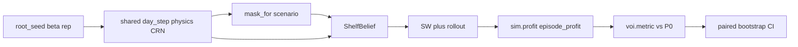

# M3 — VOI sweep (scenario × β)

**Status:** PLAN (Wave 0 architecture lock)  
**Date:** 2026-08-12  
**Authority:** Board milestone `M3 — VOI sweep, oracles, misspecification arms` (VOI-01–04 / SIM-01–05 ACCEPTED); team-owned execution plan after M2 close-out  
**Does not edit:** M1 / M1.5 / M2 plan files beyond backlog pointer

---

## 0. Placement and prerequisite

| Milestone | Intent |
| --- | --- |
| **M1 / M1.5** | Filter + RichObs + MC LL + multi-rung verification; production age belief = mean-field |
| **M2** | CTL ladder + multi-scenario closed-loop; `voi/` stayed stub |
| **M3 (this plan)** | VOI-01–04: dollar/percentage VOI surface over (knowledge scenario × β), paired CRN + bootstrap CIs |

### Prerequisite — COMPLETE (on integrated tip)

**M2** (T-022–T-034) is **DONE** on `team/T-022/verify` at `d7ee7c4` (belief API, damped SW, rollout, ladder, multi-scenario). Human merge to `main` may lag; M3 branches from the M2 verify tip.

### Settle basis (binding — do not reopen)

| Card | Settle |
| --- | --- |
| **X-06** | **A — scenario × β** only (⚑; no cadence / staggering axes) |
| **VOI-01** | **C — percentage headline + absolute $ support** vs P0 |
| **VOI-02** | **A — no honesty / misspecification arms** (⚑; clean sweep only) |
| **VOI-03** | **B — point estimate + paired bootstrap CI** |
| **VOI-04** | **B — fine β grid (10+ values)** including β=1 (⚑) |
| **SIM-01** | **B — margin − waste − stockout** via existing `sim/profit.py` |
| **SIM-02** | **C — full outer-loop CRN** across scenarios (and policies) per (β, replication) |
| **SIM-03** | **A — long trajectory + burn-in** before scored profit |
| **SIM-05** | Hierarchical `spawn_rng` semantic slots (already in package) |
| **FIL-13 / FIL-04** | Production **mean_field**; no joint reopen |
| **ENG-01** | Browser / Pyodide **parked** |

---

## 1. What M3 is / is not

| In M3 | Out |
|-------|-----|
| `voi/` library: metric, CRN cell runner, bootstrap CI, sweep orchestrator | Misspecification / CE arms (VOI-02=A) |
| Knowledge rungs: **P0, P1, F1, F1s, F2a, F2** (+ **B-state** ceiling column) | SCN-B-clair foresight; SCN-P2 / F3 |
| Fine β grid (≥10, includes 1.0); smoke grid for CI | Cadence / arrival-staggering axes (X-06=A) |
| Headline VOI % vs P0 + absolute $; retain bootstrap replicates | Claiming production compute numbers from CI smoke budgets |
| Static matplotlib VOI figure under `figures/m3/` (ENG-03=A) | Plotly / interactive embeds; browser packaging |
| ENG-04-style gate: at β=1, VOI vs P0 ≈ 0 within CI smoke tolerance | New runtime deps without ADR; reopen ⚑ without Oliver |

**Policy under each rung:** age-aware **SW + one-step rollout** consuming the belief that rung allows (P1/F* → RBPF+mask; P0 → RBPF with P0 mask; B-state → oracle `ShelfBelief`). Rung 0 / constant-order are **not** VOI columns (ladder already covered in M2).

---

## 2. Architecture

- Reuse M2 closed-loop patterns (`sim/m2_multi_scenario.py` style) but own the outer grid in **`voi/`**.
- One shared physical realization per `(beta, replication)` across all knowledge scenarios (SIM-02=C).
- `voi/` stays free of matplotlib inside the library core; figure writers live under `viz/` or `experiments/` calling into `voi`.

---

## 3. Design locks (Wave 0 ADRs)

| Lock | Choice |
|------|--------|
| **Package layout** | ADR **0094**: `voi/{metric,crn,bootstrap,sweep}.py`; public exports for metric + sweep smoke |
| **CI vs production budgets** | ADR **0095**: CI uses tiny `n_burn`/`n_score`/`n_rep`/β subset; production defaults documented separately |
| **Sweep scenario set** | ADR **0096**: M1.5 filter masks + B-state ceiling; P0 is VOI denominator |

Already ACCEPTED (do not rewrite): VOI-01–04, SIM-01–05, X-06.

---

## 4. Waves and tickets

| Wave | Tickets | Mode |
|------|---------|------|
| **0** | T-035 + ADR 0094–0096 + specs T-036–T-041 | Serial architect (docs only) |
| **1** | T-036 ∥ T-037 ∥ T-038 | Parallel foundations |
| **2** | T-039 | Sweep orchestrator + fine β grid |
| **3** | T-040 | Smoke artifact + β=1 gate + optional figure |
| **4** | T-041 | Close-out |

| ID | Title | Depends |
|----|-------|---------|
| **T-035** | M3 ADR/spec lock | M2 verify tip |
| **T-036** | VOI metric (%, $ vs P0) | T-035; ADR 0069 |
| **T-037** | Outer-loop CRN cell | T-035; ADR 0065/0066 |
| **T-038** | Paired bootstrap CI | T-035; ADR 0071 |
| **T-039** | Sweep orchestrator (scenario × β) | T-036, T-037, T-038 |
| **T-040** | Smoke run + β=1 gate + figure hook | T-039 |
| **T-041** | M3 close-out | T-040 |

Wave order: `T-035 → (T-036 ∥ T-037 ∥ T-038) → T-039 → T-040 → T-041`.

---

## 5. Definition of done (M3)

1. **`voi/`** exports metric, CRN cell, bootstrap, and sweep APIs (no longer empty stub).
2. **VOI-01**: every arm reports percentage vs P0 **and** absolute $ delta.
3. **SIM-02/03**: outer loop uses shared CRN across scenarios and burn-in before scoring.
4. **VOI-03**: paired bootstrap CI retained per arm (not means-only).
5. **VOI-04**: production default β grid has **≥10** values including **1.0**; CI may use a subset per ADR 0095.
6. **VOI-02**: no misspecification / CE arms shipped.
7. **ENG-04-ish**: automated β=1 near-zero VOI smoke (CI red if broken under smoke budgets).
8. Plain-English changelog; reviews APPROVED; qa green.
9. **No** browser / Pyodide / honesty-arm / new runtime deps.

---

## 6. Risks

| Risk | Mitigation |
|------|------------|
| Full fine grid × all rungs × rollout too slow for CI | ADR 0095 smoke budgets; production CLI/experiment separate |
| P0 profit near zero → unstable % | Document fallback to constant-order floor if needed (VOI-01 revisit clause); tests use costs that keep P0 away from zero under smoke |
| CRN desync across masks | Reuse SIM-05 streams; share demand/spoil/arrival draws; filter resample streams keyed by scenario |
| Scope creep into honesty arms / ENG-01 | Non-goals binding; T-041 asserts |

---

## 7. Immediate next step

Wave 0: land ADRs 0094–0096 + specs T-036–T-041 (this ticket T-035). Then qa RED for Wave 1.
