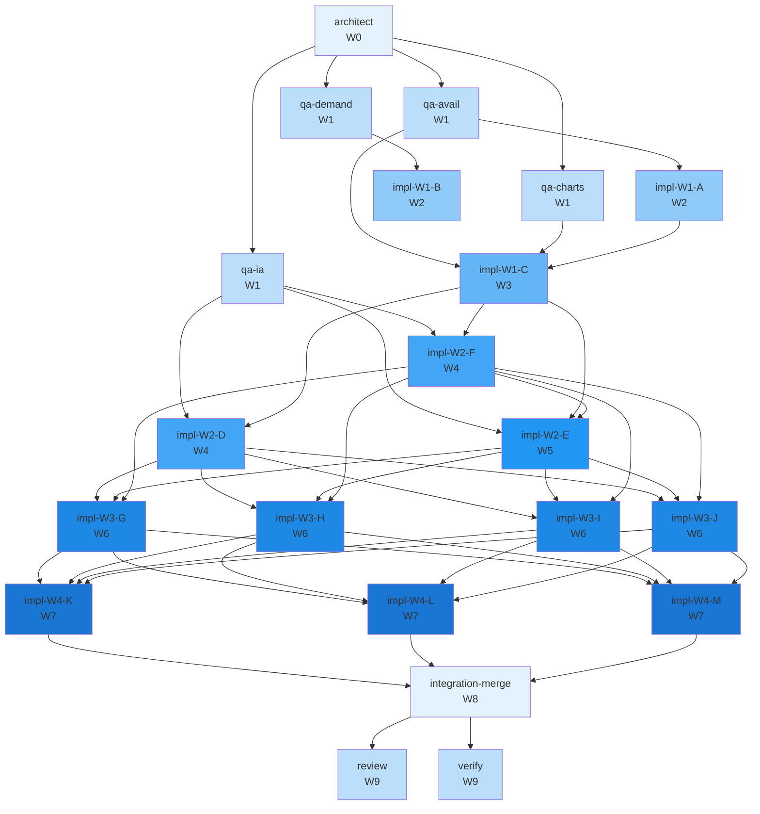

# Concurrency plan — T-124

**Parent tip:** `main`
**Peak parallelism:** 4
**Critical path length:** 10 waves

Studio UX revamp — T-119 audit remediation + IA + comprehension + polish

## Warnings
- task integration-merge: empty files list (cannot detect conflicts)

## Waves

| Wave | Parallel | Tasks |
|------|----------|-------|
| W0 | 1 | architect |
| W1 | 4 | qa-avail, qa-charts, qa-demand, qa-ia |
| W2 | 2 | impl-W1-A, impl-W1-B |
| W3 | 1 | impl-W1-C |
| W4 | 2 | impl-W2-D, impl-W2-F |
| W5 | 1 | impl-W2-E |
| W6 | 4 | impl-W3-G, impl-W3-H, impl-W3-I, impl-W3-J |
| W7 | 3 | impl-W4-K, impl-W4-L, impl-W4-M |
| W8 | 1 | integration-merge |
| W9 | 2 | review, verify |

## Worktree manifest

| Task | Branch | Path |
|------|--------|------|
| `architect` | `team/T-124/architect` | `.worktrees/T-124-architect` |
| `impl-W1-A` | `team/T-124/W1-A-implement` | `.worktrees/T-124-W1-A-implement` |
| `impl-W1-B` | `team/T-124/W1-B-implement` | `.worktrees/T-124-W1-B-implement` |
| `impl-W1-C` | `team/T-124/W1-C-implement` | `.worktrees/T-124-W1-C-implement` |
| `impl-W2-D` | `team/T-124/W2-D-implement` | `.worktrees/T-124-W2-D-implement` |
| `impl-W2-E` | `team/T-124/W2-E-implement` | `.worktrees/T-124-W2-E-implement` |
| `impl-W2-F` | `team/T-124/W2-F-implement` | `.worktrees/T-124-W2-F-implement` |
| `impl-W3-G` | `team/T-124/W3-G-implement` | `.worktrees/T-124-W3-G-implement` |
| `impl-W3-H` | `team/T-124/W3-H-implement` | `.worktrees/T-124-W3-H-implement` |
| `impl-W3-I` | `team/T-124/W3-I-implement` | `.worktrees/T-124-W3-I-implement` |
| `impl-W3-J` | `team/T-124/W3-J-implement` | `.worktrees/T-124-W3-J-implement` |
| `impl-W4-K` | `team/T-124/W4-K-implement` | `.worktrees/T-124-W4-K-implement` |
| `impl-W4-L` | `team/T-124/W4-L-implement` | `.worktrees/T-124-W4-L-implement` |
| `impl-W4-M` | `team/T-124/W4-M-implement` | `.worktrees/T-124-W4-M-implement` |
| `integration-merge` | `team/T-124/integration-merge` | `.worktrees/T-124-integration-merge` |
| `qa-avail` | `team/T-124/qa` | `.worktrees/T-124-qa-avail` |
| `qa-charts` | `team/T-124/qa` | `.worktrees/T-124-qa-charts` |
| `qa-demand` | `team/T-124/qa` | `.worktrees/T-124-qa-demand` |
| `qa-ia` | `team/T-124/qa` | `.worktrees/T-124-qa-ia` |
| `review` | `team/T-124/review` | `.worktrees/T-124-review` |
| `verify` | `team/T-124/verify` | `.worktrees/T-124-verify` |

## Mermaid

