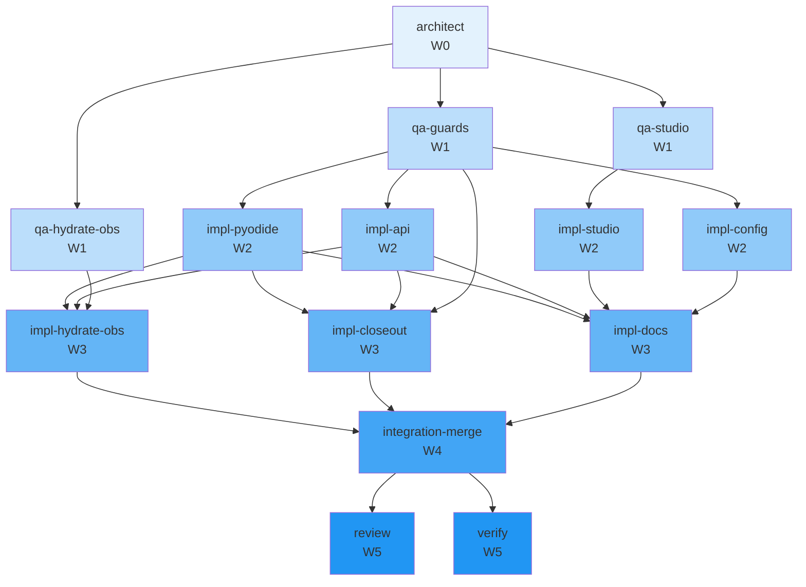

# Concurrency plan — T-125

**Parent tip:** `main`
**Peak parallelism:** 4
**Critical path length:** 6 waves

Retire Pyodide + HTTP API; WASM-only browser studio (ADR 0129)

## Warnings
- task integration-merge: empty files list (cannot detect conflicts)

## Waves

| Wave | Parallel | Tasks |
|------|----------|-------|
| W0 | 1 | architect |
| W1 | 3 | qa-guards, qa-hydrate-obs, qa-studio |
| W2 | 4 | impl-api, impl-config, impl-pyodide, impl-studio |
| W3 | 3 | impl-closeout, impl-docs, impl-hydrate-obs |
| W4 | 1 | integration-merge |
| W5 | 2 | review, verify |

## Worktree manifest

| Task | Branch | Path |
|------|--------|------|
| `architect` | `team/T-125/architect` | `.worktrees/T-125-architect` |
| `impl-api` | `team/T-125/api-implement` | `.worktrees/T-125-api-implement` |
| `impl-closeout` | `team/T-125/closeout-implement` | `.worktrees/T-125-closeout-implement` |
| `impl-config` | `team/T-125/config-implement` | `.worktrees/T-125-config-implement` |
| `impl-docs` | `team/T-125/docs-implement` | `.worktrees/T-125-docs-implement` |
| `impl-hydrate-obs` | `team/T-125/hydrate-obs-implement` | `.worktrees/T-125-hydrate-obs-implement` |
| `impl-pyodide` | `team/T-125/pyodide-implement` | `.worktrees/T-125-pyodide-implement` |
| `impl-studio` | `team/T-125/studio-implement` | `.worktrees/T-125-studio-implement` |
| `integration-merge` | `team/T-125/integration-merge` | `.worktrees/T-125-integration-merge` |
| `qa-guards` | `team/T-125/qa` | `.worktrees/T-125-qa-guards` |
| `qa-hydrate-obs` | `team/T-125/qa` | `.worktrees/T-125-qa-hydrate-obs` |
| `qa-studio` | `team/T-125/qa` | `.worktrees/T-125-qa-studio` |
| `review` | `team/T-125/review` | `.worktrees/T-125-review` |
| `verify` | `team/T-125/verify` | `.worktrees/T-125-verify` |

## Mermaid

