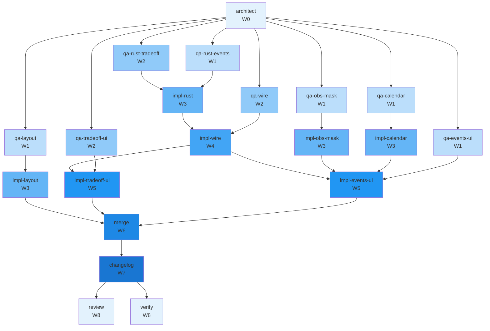

# Concurrency plan — T-127

**Parent tip:** `main`
**Peak parallelism:** 5
**Critical path length:** 8 waves

Cockpit Grid layout (Layout 1): fixed 3-row grid with always-on Primary/Secondary/ Economics/Events/Run panes, tuning-dock tab strip; WASM tradeoff_forecast RPC (Options A+B Monte Carlo + joint histogram) and events RPC (masked richest_log window); frontend tradeoff mini-charts and EventsPane with obsMask.ts port.

## Waves

| Wave | Parallel | Tasks |
|------|----------|-------|
| W0 | 1 | architect |
| W1 | 5 | qa-calendar, qa-events-ui, qa-layout, qa-obs-mask, qa-rust-events |
| W2 | 3 | qa-rust-tradeoff, qa-tradeoff-ui, qa-wire |
| W3 | 4 | impl-calendar, impl-layout, impl-obs-mask, impl-rust |
| W4 | 1 | impl-wire |
| W5 | 2 | impl-events-ui, impl-tradeoff-ui |
| W6 | 1 | merge |
| W7 | 1 | changelog |
| W8 | 2 | review, verify |

## Worktree manifest

| Task | Branch | Path |
|------|--------|------|
| `architect` | `team/T-127/architect` | `.worktrees/T-127-architect` |
| `changelog` | `team/T-127/changelog-implement` | `.worktrees/T-127-changelog-implement` |
| `impl-calendar` | `team/T-127/calendar-implement` | `.worktrees/T-127-calendar-implement` |
| `impl-events-ui` | `team/T-127/events-ui-implement` | `.worktrees/T-127-events-ui-implement` |
| `impl-layout` | `team/T-127/layout-implement` | `.worktrees/T-127-layout-implement` |
| `impl-obs-mask` | `team/T-127/obs-mask-implement` | `.worktrees/T-127-obs-mask-implement` |
| `impl-rust` | `team/T-127/rust-implement` | `.worktrees/T-127-rust-implement` |
| `impl-tradeoff-ui` | `team/T-127/tradeoff-ui-implement` | `.worktrees/T-127-tradeoff-ui-implement` |
| `impl-wire` | `team/T-127/wire-implement` | `.worktrees/T-127-wire-implement` |
| `merge` | `team/T-127/merge-implement` | `.worktrees/T-127-merge-implement` |
| `qa-calendar` | `team/T-127/qa` | `.worktrees/T-127-qa-calendar` |
| `qa-events-ui` | `team/T-127/qa` | `.worktrees/T-127-qa-events-ui` |
| `qa-layout` | `team/T-127/qa` | `.worktrees/T-127-qa-layout` |
| `qa-obs-mask` | `team/T-127/qa` | `.worktrees/T-127-qa-obs-mask` |
| `qa-rust-events` | `team/T-127/qa` | `.worktrees/T-127-qa-rust-events` |
| `qa-rust-tradeoff` | `team/T-127/qa` | `.worktrees/T-127-qa-rust-tradeoff` |
| `qa-tradeoff-ui` | `team/T-127/qa` | `.worktrees/T-127-qa-tradeoff-ui` |
| `qa-wire` | `team/T-127/qa` | `.worktrees/T-127-qa-wire` |
| `review` | `team/T-127/review` | `.worktrees/T-127-review` |
| `verify` | `team/T-127/verify` | `.worktrees/T-127-verify` |

## Mermaid

