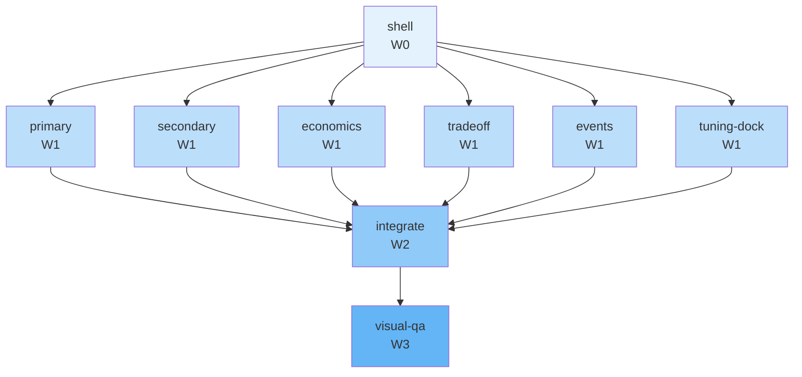

# Concurrency plan — T-127

**Parent tip:** `team/T-127/merge-implement`
**Peak parallelism:** 6
**Critical path length:** 4 waves

Round 2 studio cockpit refinement: real freshness x time heatmap with sub-day interpolation + truth overlay on Primary, true stacked freshness histogram on Secondary, consolidated P&L chart in Economics, tradeoff chart mean-line overlays, scenario-aware Events pane with mocked delivery temperature history, tuning-dock content fixes (demand/arrival/physics/ logistics/autopilot), and removal of the duplicate order-qty control. See t-127_studio_cockpit_refinement_f94aafd2.plan.md for full detail.

## Waves

| Wave | Parallel | Tasks |
|------|----------|-------|
| W0 | 1 | shell |
| W1 | 6 | economics, events, primary, secondary, tradeoff, tuning-dock |
| W2 | 1 | integrate |
| W3 | 1 | visual-qa |

## Worktree manifest

| Task | Branch | Path |
|------|--------|------|
| `economics` | `team/T-127/economics-implement` | `.worktrees/T-127-economics-implement` |
| `events` | `team/T-127/events-implement` | `.worktrees/T-127-events-implement` |
| `integrate` | `team/T-127/integrate-implement` | `.worktrees/T-127-integrate-implement` |
| `primary` | `team/T-127/primary-implement` | `.worktrees/T-127-primary-implement` |
| `secondary` | `team/T-127/secondary-implement` | `.worktrees/T-127-secondary-implement` |
| `shell` | `team/T-127/shell-implement` | `.worktrees/T-127-shell-implement` |
| `tradeoff` | `team/T-127/tradeoff-implement` | `.worktrees/T-127-tradeoff-implement` |
| `tuning-dock` | `team/T-127/tuning-dock-implement` | `.worktrees/T-127-tuning-dock-implement` |
| `visual-qa` | `team/T-127/verify` | `.worktrees/T-127-visual-qa` |

## Mermaid

