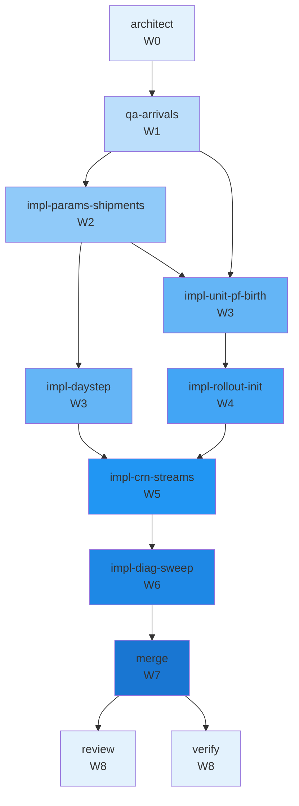

# Concurrency plan — T-138

**Parent tip:** `main`
**Peak parallelism:** 2
**Critical path length:** 9 waves

Stage A — heterogeneous arrivals: within-lot birth dispersion on truth and filter, STREAM_BIRTH CRN, rollout belief init fix. Shared-decrement likelihood unchanged.

## Waves

| Wave | Parallel | Tasks |
|------|----------|-------|
| W0 | 1 | architect |
| W1 | 1 | qa-arrivals |
| W2 | 1 | impl-params-shipments |
| W3 | 2 | impl-daystep, impl-unit-pf-birth |
| W4 | 1 | impl-rollout-init |
| W5 | 1 | impl-crn-streams |
| W6 | 1 | impl-diag-sweep |
| W7 | 1 | merge |
| W8 | 2 | review, verify |

## Worktree manifest

| Task | Branch | Path |
|------|--------|------|
| `architect` | `team/T-138/architect` | `.worktrees/T-138-architect` |
| `impl-crn-streams` | `team/T-138/crn-streams-implement` | `.worktrees/T-138-crn-streams-implement` |
| `impl-daystep` | `team/T-138/daystep-implement` | `.worktrees/T-138-daystep-implement` |
| `impl-diag-sweep` | `team/T-138/diag-sweep-implement` | `.worktrees/T-138-diag-sweep-implement` |
| `impl-params-shipments` | `team/T-138/params-shipments-implement` | `.worktrees/T-138-params-shipments-implement` |
| `impl-rollout-init` | `team/T-138/rollout-init-implement` | `.worktrees/T-138-rollout-init-implement` |
| `impl-unit-pf-birth` | `team/T-138/unit-pf-birth-implement` | `.worktrees/T-138-unit-pf-birth-implement` |
| `merge` | `team/T-138/merge` | `.worktrees/T-138-merge` |
| `qa-arrivals` | `team/T-138/qa` | `.worktrees/T-138-qa-arrivals` |
| `review` | `team/T-138/review` | `.worktrees/T-138-review` |
| `verify` | `team/T-138/verify` | `.worktrees/T-138-verify` |

## Mermaid

