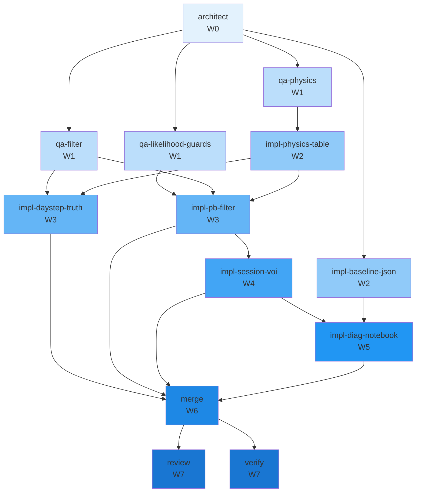

# Concurrency plan — T-141

**Parent tip:** `team/T-140/implement`
**Optimize:** `balanced`
**Peak parallelism (executed):** 3
**Critical path length:** 8 waves (maximal DAG)

Independent per-unit gamma aging (truth + filter), Poisson-binomial spoilage DP, GammaDecrementTable (4096 grid), delete ADR-0137 interval primitives, regen GSIN/UPC diag.

## Waves

| Wave | Parallel | Tasks |
|------|----------|-------|
| W0 | 1 | architect |
| W1 | 3 | qa-filter, qa-likelihood-guards, qa-physics |
| W2 | 2 | impl-baseline-json, impl-physics-table |
| W3 | 2 | impl-daystep-truth, impl-pb-filter |
| W4 | 1 | impl-session-voi |
| W5 | 1 | impl-diag-notebook |
| W6 | 1 | merge |
| W7 | 2 | review, verify |

## Worktree manifest

*QA parallel tracks use `*-implement` branch suffix per `claim-role-worktree.sh`.*

| Task | Branch | Path | claim_cmd |
|------|--------|------|-----------|
| `architect` | `team/T-141/architect` | `.worktrees/T-141-architect` | `claim-role-worktree.sh T-141 architect` |
| `impl-baseline-json` | `team/T-141/impl-baseline-json-implement` | `.worktrees/T-141-impl-baseline-json-implement` | `claim-role-worktree.sh T-141 impl-baseline-json-implement` |
| `impl-daystep-truth` | `team/T-141/impl-daystep-truth-implement` | `.worktrees/T-141-impl-daystep-truth-implement` | `claim-role-worktree.sh T-141 impl-daystep-truth-implement` |
| `impl-diag-notebook` | `team/T-141/impl-diag-notebook-implement` | `.worktrees/T-141-impl-diag-notebook-implement` | `claim-role-worktree.sh T-141 impl-diag-notebook-implement` |
| `impl-pb-filter` | `team/T-141/impl-pb-filter-implement` | `.worktrees/T-141-impl-pb-filter-implement` | `claim-role-worktree.sh T-141 impl-pb-filter-implement` |
| `impl-physics-table` | `team/T-141/impl-physics-table-implement` | `.worktrees/T-141-impl-physics-table-implement` | `claim-role-worktree.sh T-141 impl-physics-table-implement` |
| `impl-session-voi` | `team/T-141/impl-session-voi-implement` | `.worktrees/T-141-impl-session-voi-implement` | `claim-role-worktree.sh T-141 impl-session-voi-implement` |
| `merge` | `team/T-141/merge-implement` | `.worktrees/T-141-merge-implement` | `claim-role-worktree.sh T-141 merge-implement` |
| `qa-filter` | `team/T-141/qa-filter-implement` | `.worktrees/T-141-qa-filter-implement` | `claim-role-worktree.sh T-141 qa-filter-implement` |
| `qa-likelihood-guards` | `team/T-141/qa-likelihood-guards-implement` | `.worktrees/T-141-qa-likelihood-guards-implement` | `claim-role-worktree.sh T-141 qa-likelihood-guards-implement` |
| `qa-physics` | `team/T-141/qa-physics-implement` | `.worktrees/T-141-qa-physics-implement` | `claim-role-worktree.sh T-141 qa-physics-implement` |
| `review` | `team/T-141/review` | `.worktrees/T-141-review` | `claim-role-worktree.sh T-141 review` |
| `verify` | `team/T-141/verify` | `.worktrees/T-141-verify` | `claim-role-worktree.sh T-141 verify` |

## Mermaid

