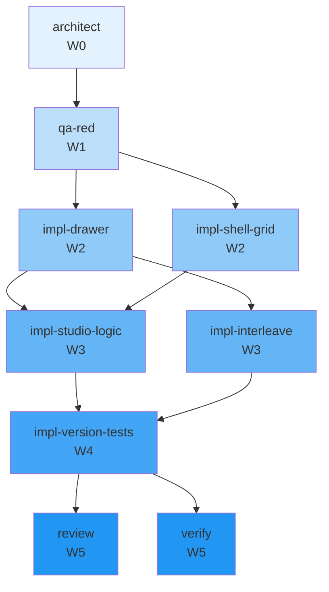

# Concurrency plan — T-158

**Parent tip:** `main`
**Peak parallelism:** 2
**Critical path length:** 6 waves

Layout v7 — move tuning dock to right-side TuningDrawer (gear trigger), single-row cockpit grid metrics | belief | sidebar, 2-column interleaved drawer interior.

## Waves

| Wave | Parallel | Tasks |
|------|----------|-------|
| W0 | 1 | architect |
| W1 | 1 | qa-red |
| W2 | 2 | impl-drawer, impl-shell-grid |
| W3 | 2 | impl-interleave, impl-studio-logic |
| W4 | 1 | impl-version-tests |
| W5 | 2 | review, verify |

## Worktree manifest

| Task | Branch | Path |
|------|--------|------|
| `architect` | `team/T-158/architect` | `.worktrees/T-158-architect` |
| `impl-drawer` | `team/T-158/drawer-implement` | `.worktrees/T-158-drawer-implement` |
| `impl-interleave` | `team/T-158/interleave-implement` | `.worktrees/T-158-interleave-implement` |
| `impl-shell-grid` | `team/T-158/shell-grid-implement` | `.worktrees/T-158-shell-grid-implement` |
| `impl-studio-logic` | `team/T-158/studio-logic-implement` | `.worktrees/T-158-studio-logic-implement` |
| `impl-version-tests` | `team/T-158/version-tests-implement` | `.worktrees/T-158-version-tests-implement` |
| `qa-red` | `team/T-158/qa` | `.worktrees/T-158-qa-red` |
| `review` | `team/T-158/review` | `.worktrees/T-158-review` |
| `verify` | `team/T-158/verify` | `.worktrees/T-158-verify` |

## Mermaid

