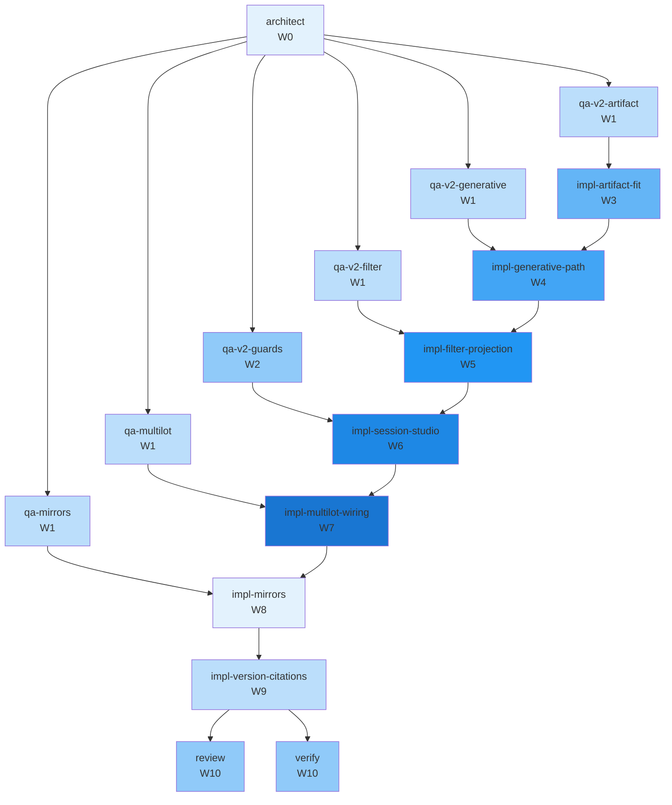

# Concurrency plan — T-163

**Parent tip:** `team/arrival-breaks/integrate`
**Peak parallelism:** 5
**Critical path length:** 10 waves

PR #65 finish — Stage 1 transit generative v2 (bottom-up Abdella stages, trip modes, hourly OU, 0150 breaks, filter projection), Stage 2 multi-lot L=3 birth wiring, Stage 3 Python/TS/wire mirrors + version bump + docs code-ref re-pins.

## Waves

| Wave | Parallel | Tasks |
|------|----------|-------|
| W0 | 1 | architect |
| W1 | 5 | qa-mirrors, qa-multilot, qa-v2-artifact, qa-v2-filter, qa-v2-generative |
| W2 | 1 | qa-v2-guards |
| W3 | 1 | impl-artifact-fit |
| W4 | 1 | impl-generative-path |
| W5 | 1 | impl-filter-projection |
| W6 | 1 | impl-session-studio |
| W7 | 1 | impl-multilot-wiring |
| W8 | 1 | impl-mirrors |
| W9 | 1 | impl-version-citations |
| W10 | 2 | review, verify |

## Worktree manifest

| Task | Branch | Path |
|------|--------|------|
| `architect` | `team/T-163/architect` | `.worktrees/T-163-architect` |
| `impl-artifact-fit` | `team/T-163/artifact-fit-implement` | `.worktrees/T-163-artifact-fit-implement` |
| `impl-filter-projection` | `team/T-163/filter-projection-implement` | `.worktrees/T-163-filter-projection-implement` |
| `impl-generative-path` | `team/T-163/generative-path-implement` | `.worktrees/T-163-generative-path-implement` |
| `impl-mirrors` | `team/T-163/mirrors-implement` | `.worktrees/T-163-mirrors-implement` |
| `impl-multilot-wiring` | `team/T-163/multilot-wiring-implement` | `.worktrees/T-163-multilot-wiring-implement` |
| `impl-session-studio` | `team/T-163/session-studio-implement` | `.worktrees/T-163-session-studio-implement` |
| `impl-version-citations` | `team/T-163/version-citations-implement` | `.worktrees/T-163-version-citations-implement` |
| `qa-mirrors` | `team/T-163/qa` | `.worktrees/T-163-qa-mirrors` |
| `qa-multilot` | `team/T-163/qa` | `.worktrees/T-163-qa-multilot` |
| `qa-v2-artifact` | `team/T-163/qa` | `.worktrees/T-163-qa-v2-artifact` |
| `qa-v2-filter` | `team/T-163/qa` | `.worktrees/T-163-qa-v2-filter` |
| `qa-v2-generative` | `team/T-163/qa` | `.worktrees/T-163-qa-v2-generative` |
| `qa-v2-guards` | `team/T-163/qa` | `.worktrees/T-163-qa-v2-guards` |
| `review` | `team/T-163/review` | `.worktrees/T-163-review` |
| `verify` | `team/T-163/verify` | `.worktrees/T-163-verify` |

## Mermaid

